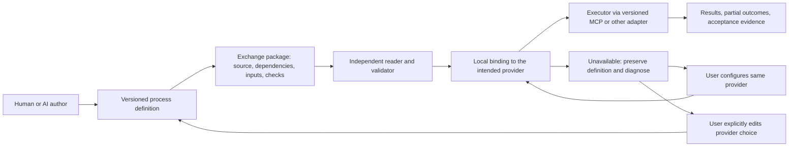

# Comparison and recommended roles

Research date: 2026-09-07. All selections are **recommendations**, not accepted
dependencies. Versions and evidence limits are in [the source register](sources.md).
Implementation availability below means official code or documentation was
inspected; no external conformance suite was run during this research.

| Candidate and reviewed version | What it contributes | Implementation / interoperability evidence | Recommended role and principal gap |
|---|---|---|---|
| [Open Workflow Specification 1.0.3](sources.md#s02-open-workflow-specification) (formerly Serverless Workflow) | JSON/YAML service orchestration, data flow, error handling, MCP calls | Java SDK/runtime, Synapse, schemas, Gherkin CTK; inspected call tests cover HTTP/OpenAPI, not MCP | **Trial as first executable profile.** Native MCP binding makes it a closer fit than inventing a call language. Publisher identity, preserved unknown blocks, engineering evidence and current MCP lifecycle require work. |
| [CWL 1.2.1](sources.md#s03-cwl) (`cwlVersion: v1.2`) | Typed batch workflows, command execution, requirements versus hints, packed definitions | cwltool; multiple listed engines; versioned positive/negative conformance cases | **Trial as calculation/batch baseline and executable fallback.** CAD/MCP needs an explicit adapter; human approval and stateful application resources are not its central model. |
| [BPMN 2.0.2](sources.md#s04-bpmn-and-dmn) | Process control, user/service tasks, gateways, events, error/compensation modeling, XML/diagram exchange | Flowable, Camunda, bpmn-moddle, OMG MIWG interchange cases | **Reference; trial for human workflow profile.** Mature control model, but vendor service bindings prevent assuming executable portability from shared XML. |
| [DMN 1.5 formal](sources.md#s04-bpmn-and-dmn) | Decisions, decision tables, FEEL | DMN TCK and reported engine results | **Reference/optional adoption** for richer acceptance decisions. A decision does not perform a measurement or grant human approval. 1.6/1.7 beta listings are not formal baselines. |
| [SysML 2.0 / KerML 1.0 / Systems Modeling API 1.0](sources.md#s05-sysml-kerml-and-apis) | Engineering types, requirements, actions, quantities, verification; versioned model services | Pilot parser/editor, libraries, API pilot and normative conformance scenarios | **Reference engineering meaning and model identity.** A full modeling-language stack is too broad for the first exchange; model access is not CAD execution. |
| [STEP AP242 ed. 4 / AP238 ed. 3](sources.md#s06-step-and-manufacturing-geometry) | Product/PMI exchange; machining manufacturing models | STEPcode, STEP Tools, NIST analyzer; CAx recommended practices and test rounds | **Reference artifact contracts**, AP238 when actual machining scope requires it. STEP import does not preserve an MCP block's provider or native parametric editing contract. Normative ISO text not fully accessed. |
| [ISA-95 / B2MML 7](sources.md#s07-isa-95-b2mml-and-automationml) | Manufacturing operations, resource and enterprise exchange models | MESA XSDs, examples; generated JSON schema explicitly untested by publisher | **Reference manufacturing vocabulary; reuse versioned XML payloads when needed.** No general CAD/AI executor or provider binding. |
| [AutomationML / IEC 62714-1:2018](sources.md#s07-isa-95-b2mml-and-automationml) | Automation engineering objects, links, libraries, multi-file packages | Aml.Engine, CAEX support, association examples/recommendations | **Reference plant/toolchain data and container practice.** Libraries and external files remain dependencies; AML is not the proposed process runtime. |
| [QIF 3.0 / ISO 23952:2020](sources.md#s08-qif) | Quality plans/results and links to product characteristics | C++/C#/Python bindings, sample files, XSD/XSLT validation tools | **Adopt/reference inspection artifacts** when quality scope arrives. Document validity does not prove measurement quality or approval. |
| [MCP 2026-07-28; Wright 2025-11-25](sources.md#s01-mcp) | Tool/resource discovery, invocation, schemas and protocol errors | Official SDKs, Inspector, conformance framework, registry publisher verification | **Adopt as an explicitly versioned protocol binding.** It does not define our process, stable CAD identity, or engineering acceptance. Older and newer lifecycle semantics differ. |
| [A2A 1.0.1](sources.md#s09-a2a-and-opc-ua) | Agent discovery, messages, tasks, artifacts, capability/auth errors | Protocol schema, SDK ecosystem, TCK repository | **Reference optional communication.** Delegating a task does not expose or preserve its internal executable process. |
| [OPC UA 1.05 series](sources.md#s09-a2a-and-opc-ua) | Industrial services/information models, typed result quality | Foundation .NET stack, profiles, restricted-access CTT | **Reference device/service adapters.** Connectivity and status codes are distinct from engineering process semantics. |
| [RO-Crate 1.2 / PROV](sources.md#s10-packaging-provenance-and-dependencies) | Descriptive packages and linked evidence/provenance | ro-crate-py, profile validator, Workflow Run RO-Crate | **Trial RO-Crate packaging; reference provenance.** Neither guarantees dependency installation or executable meaning. |
| [JSON Schema 2020-12 / UCUM 2.2 / Python packaging](sources.md#s11-schema-units-and-error-formats) | Structural validation, unit codes, dependency/version/platform precedent | JSON Schema Test Suite, UCUM resources, packaging implementations | **Adopt appropriate building blocks.** Graph invariants, CAD compatibility and acceptance evidence still need explicit rules. |
| [FMI/SSP, AAS, SCXML](sources.md#s12-additional-boundaries) | Simulation exchange, digital-twin resources, state machines | Reference FMUs, BaSyx, Commons SCXML | **Reference when those domains are needed.** They are useful boundaries, not reasons to require every process to adopt their complete models. |

## Decision implied by the comparison

No reviewed standard alone demonstrates faithful, executable exchange of
Wright's named CAD/MCP process across installations. This is a conclusion from
the identified coverage and missing tests, not proof that every possible
implementation lacks the feature.

Start with **package preservation + intended provider/resource requirements +
bounded execution + verifiable results**. Prefer a profile of existing syntax.
Evaluate OWS for fixed MCP steps, CWL for calculation, and BPMN for approval
before selecting one executable representation for the first release. Do not
require three workflow languages in the initial specification.

The application owns environment checks, diagnostics, credentials, execution
gating and replacement interaction. The portable contract owns the facts
needed to do those jobs faithfully. See [detailed findings](findings.md),
[worked cases](../use-cases/interoperability.md), and
[the proposed decision and plan](../decisions/001-first-boundary.md).
